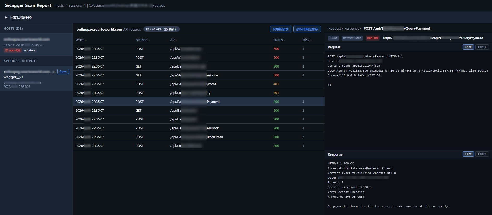
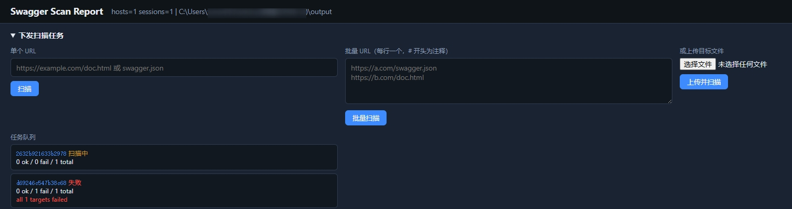
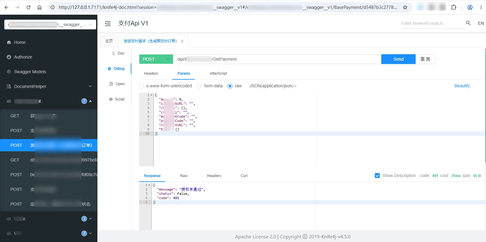

# swagger-exp-knife4j


## Overview

An automated discovery and probing tool for **Swagger / Knife4j / OpenAPI** API documentation.

**swagger-exp-knife4j** is designed around common Swagger (OpenAPI 2/3) and Knife4j documentation entry patterns. Its core purpose is to batch-scan API specs for **unauthorized access** risks.

It runs standalone on **Web** and **CLI** across platforms for team workflows. Scan results can be reviewed in a **web report** UI. A custom **response similarity** pipeline (SimHash) helps organize probe data, assess risk, and present **Burp-style** request/response views. You can drive live API calls through an embedded **Knife4j** view and export API docs in multiple formats.

**MCP** integration ships with three built-in tools covering scan-through-report workflows, plus documented MCP tool contracts and extension hooks to reduce token overhead when you extend the project with AI assistants.

## Tech stack

| Category   | Choice                                                   |
| ---------- | -------------------------------------------------------- |
| Language   | Go (see `go.mod`)                                        |
| CLI        | [Cobra](https://github.com/spf13/cobra)                  |
| ORM / DB   | GORM + SQLite                                            |
| Web        | Standard library `net/http`, static assets via `go:embed` |
| MCP        | [mcp-go](https://github.com/mark3labs/mcp-go) (stdio)    |

## Features

| Capability              | Description                                                                 |
| ----------------------- | --------------------------------------------------------------------------- |
| Web visualization       | Host-centric record browser; Burp-style Request/Response; list dedup & similarity sort; large-body preview slices |
| Web-triggered scans     | Submit single URL, multi-line, or file batch jobs from the report UI          |
| Dual runtime modes      | CLI for automation/skills + web server for interactive review               |
| Multi-source doc entry  | `swagger.json`, `/v3/api-docs`, Knife4j, `doc.html`, and similar entry URLs |
| Response similarity     | SimHash + Hamming grouping (`internal/islazy`); clustering fields in report API |
| Configurable HTTP       | Headers, cookies, proxy, concurrency, timeouts—curl-style flags              |
| MCP integration         | Standard MCP for LLM-driven scans and result analysis                       |
| Structured probe records| Full metadata + raw HTTP exchange JSON (Burp-friendly)                        |
| Extension points        | Hooks for custom scanners/writers/CLI/MCP—see docs “Module development”     |

## Commands

Three top-level modules: **scan**, **report**, **mcp**

```bash
Usage:
  swagger-exp-knife4j [command]

Available Commands:
  help        Help about any command
  mcp         Model Context Protocol (MCP) server for AI clients
  report      View stored Swagger scan reports
  scan        Scan Swagger API interfaces
  version     Show build version information

Flags:
  -D, --debug-log   Show debug logging
  -h, --help        help for swagger-exp-knife4j
  -q, --quiet       Silence (almost all) logging
```

### scan

```bash
## Scans Swagger/Knife4j/OpenAPI targets and auto-probes interfaces.
## Subcommands: single (one URL), file (URL list file).

Usage:
  swagger-exp-knife4j scan [command]

Examples:
swagger-exp-knife4j scan single -u https://example.com/doc.html --write-db
swagger-exp-knife4j scan file -f targets.txt --write-db

Available Commands:
  file        Scan multiple targets listed in a file
  single      Scan a single URL target

Flags:
      --connect-timeout duration   Max wait for TCP connect (default 30s)
  -b, --cookie stringArray         Cookie string or file (repeatable), e.g. -b "session=abc"
      --delay duration             Sleep between each API request (e.g. 100ms, 1s)
      --docs-only                  Only resolve and dump OpenAPI JSON to --output-dir; skip automated API requests and --write-* outputs
  -H, --header stringArray         Custom request header (repeatable), e.g. -H "Authorization: Bearer xxx"
  -h, --help                       help for scan
  -m, --max-timeout duration       Per-request timeout (0 = unlimited)
      --output-dir string          Base directory for scan output ({host}/{scope}/api-docs.json) (default "output")
  -P, --parallel int               Concurrent API request workers (default 1)
  -x, --proxy string               HTTP proxy URL, e.g. -x http://127.0.0.1:8080
  -A, --user-agent string          User-Agent string, e.g. -A "Mozilla/5.0"
      --write-csv                  Write scan results to CSV (default result.csv)
      --write-csv-file string      CSV file path (overrides --write-csv default)
      --write-db                   Write scan results to database (default sqlite://swagger-scan.sqlite3)
      --write-db-enable-debug      Show the database query debug logging
      --write-db-uri string        Database URI (overrides --write-db default)
      --write-jsonl                Write scan results to JSONL (default result.jsonl)
      --write-jsonl-file string      JSONL file path (overrides --write-jsonl default)

Global Flags:
  -D, --debug-log   Show debug logging
  -q, --quiet       Silence (almost all) logging

Use "swagger-exp-knife4j scan [command] --help" for more information about a command.
```

### report

```bash
## View stored scan results and browse them in the terminal or web UI.

Usage:
  swagger-exp-knife4j report [command]

Examples:
swagger-exp-knife4j report list
swagger-exp-knife4j report server

Available Commands:
  list        List API scan records from the database
  server      Start local web server to browse scan results

Flags:
      --db-uri string   Swagger scan database URI (e.g. sqlite://swagger-scan.sqlite3) (default "sqlite://swagger-scan.sqlite3")
  -h, --help            help for report

Global Flags:
  -D, --debug-log   Show debug logging
  -q, --quiet       Silence (almost all) logging

Use "swagger-exp-knife4j report [command] --help" for more information about a command.
```

### mcp

```bash
## Start the MCP service for large language model clients.

Usage:
  swagger-exp-knife4j mcp [command]

Examples:
swagger-exp-knife4j mcp serve

Available Commands:
  serve       Run MCP server on stdio (for Cursor / Claude Desktop)

Flags:
  -h, --help   help for mcp

Global Flags:
  -D, --debug-log   Show debug logging
  -q, --quiet       Silence (almost all) logging

Use "swagger-exp-knife4j mcp [command] --help" for more information about a command.
```

## Quick start

```bash
# Build
go build -o swagger-exp-knife4j .

# Scan: -u is a Swagger UI page or OpenAPI JSON URL; probes GET/POST endpoints; --write-db persists to default SQLite
swagger-exp-knife4j scan single -u https://example.com/doc.html --write-db -q

# Local report server (supports submitting new scan jobs from the web UI)
swagger-exp-knife4j report server
```

Open **http://127.0.0.1:7171/** in your browser.

- Select a **Host** on the left to load the probe table (data from SQLite).
- Middle panel: **Latest request only** (dedupe by Method + path), **Sort by similar response** (SimHash cluster fields).
- Select a row to inspect Request/Response on the right (body preview capped at 64 KiB).
- **API Docs** previews OpenAPI from `./output`; **Open Knife4j** sends try-it requests via the report server reverse proxy—see [Knife4j docs](https://doc.xiaominfo.com/docs/blog).
- Collapsible **Submit scan task** at the top for new scans.







## Docker

```bash
docker compose up -d --build
```

SQLite and `output/` are persisted via volumes. Scan examples:[wiki_swagger-exp-knife4j]([docs/docker.md](https://wsece.github.io/wiki_swagger-exp-knife4j/source_md/docker.html)).

## Documentation

Project documentation (white-paper style): [wiki_swagger-exp-knife4j](https://wsece.github.io/wiki_swagger-exp-knife4j/)

## License & disclaimer

By downloading or using this tool, you indicate that you accept it as-is. We are **not liable** for any loss or harm arising from its use. Any illegal use is solely your responsibility; we assume **no legal liability**. Downloading, installing, or using the software constitutes acceptance of this disclaimer.


